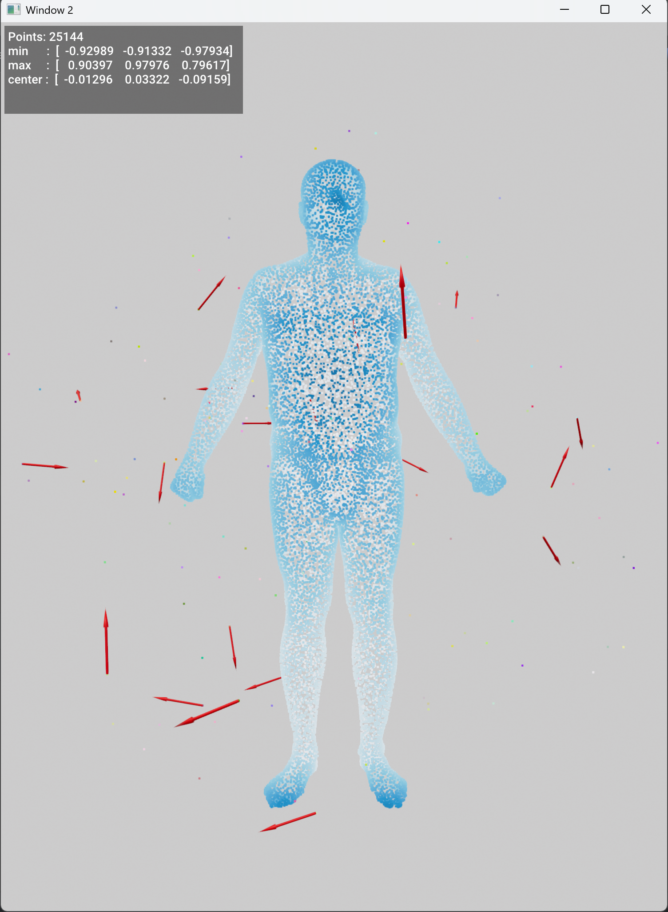

<!-- ## Noise -->

Classes for adding noise into point cloud

## AddOutlier
::: augmentation_class.AddOutlier
    handler: python
    options:
        show_root_heading: False
        show_root_toc_entry: False
        show_source: False
        members: [__call__]
**Adding Outlier Noise**

  
  

## AddBackgroundNoise
::: augmentation_class.AddBackgroundNoise
    handler: python
    options:
        show_root_heading: False
        show_root_toc_entry: False
        show_source: False
        members: [__call__]
**Adding Background Noise**

  
  

## AddNoise
::: augmentation_class.AddNoise
    handler: python
    options:
        show_root_heading: False
        show_root_toc_entry: False
        show_source: False
        members: [__call__]
**Adding Noise**

  
  

